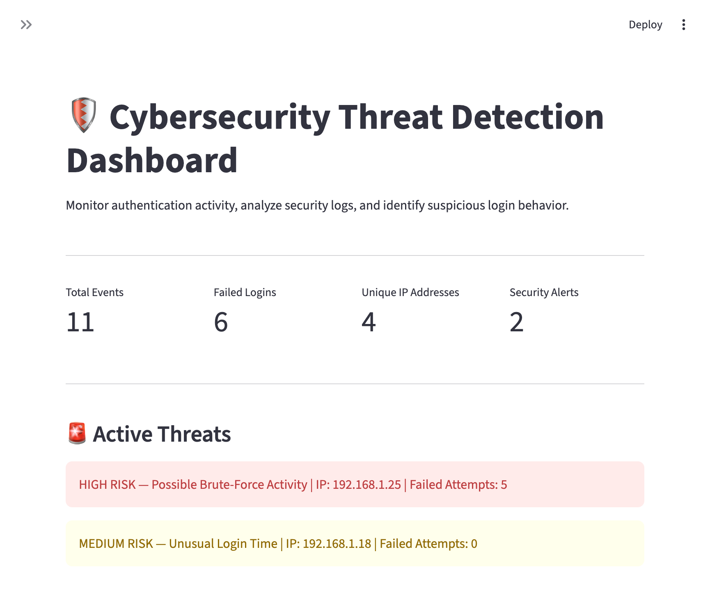
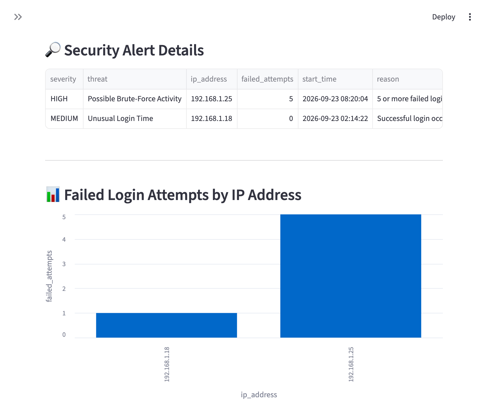
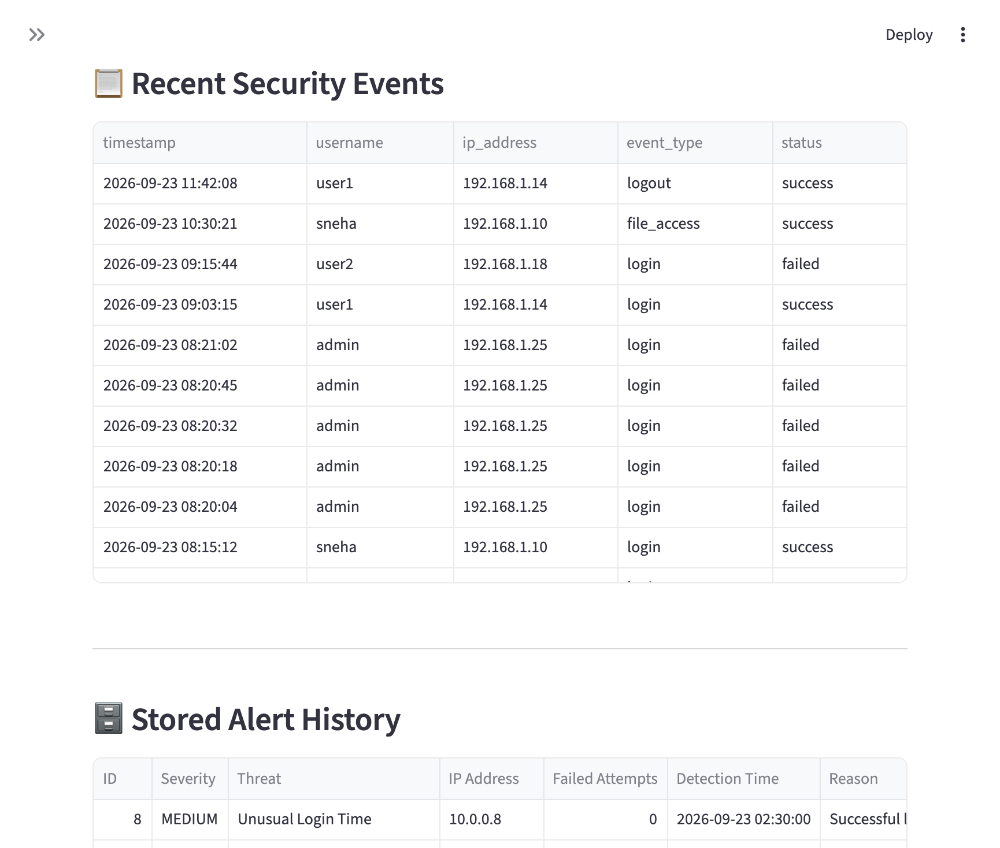

# Cybersecurity Threat Detection & Log Analysis System

A Python-based cybersecurity monitoring application that analyzes authentication logs, detects suspicious activity, assigns threat severity levels, stores security alerts, and displays results through an interactive dashboard.
## Live Demo

🔗 [View the Live Cybersecurity Threat Detection Dashboard](https://cybersecurity-log-analyzer-nhx988tjtsr85uokqw3uhg.streamlit.app/)

## Project Overview

This project was created to demonstrate practical cybersecurity concepts including security log analysis, authentication monitoring, rule-based threat detection, alert classification, input validation, and security event storage.

The application can analyze built-in sample logs or user-uploaded CSV security logs.

## Features

- Analyze authentication and security event logs
- Detect repeated failed login attempts
- Identify possible brute-force activity
- Detect successful logins during unusual hours
- Classify alerts as MEDIUM or HIGH severity
- Upload and analyze external CSV log files
- Validate uploaded security log data
- Visualize failed login activity by IP address
- Display recent security events
- Store detected alerts using SQLite
- Maintain persistent security alert history

## Detection Rules

### Possible Brute-Force Activity — HIGH

The system generates a HIGH severity alert when an IP address produces 5 or more failed login attempts within a 5-minute period.

### Suspicious Login Activity — MEDIUM

The system generates a MEDIUM severity alert when an IP address produces 3–4 failed login attempts within a 5-minute period.

### Unusual Login Time — MEDIUM

A successful login occurring between 12:00 AM and 5:00 AM is flagged for review.

These rules are simplified for educational and demonstration purposes. An alert indicates activity that may require investigation and does not by itself prove malicious behavior.

## Technologies

- Python
- Pandas
- Streamlit
- SQLite
- Git
- GitHub

## Project Architecture

Security Logs / Uploaded CSV

↓

Log Parsing & Validation

↓

Python Detection Engine

↓

Threat Classification

↓

SQLite Alert Storage

↓

Streamlit Dashboard

## Security Practices

The project uses parameterized SQLite queries when storing alert information. Uploaded log files are also validated for required columns and timestamp formatting before analysis.

## Required CSV Format

Uploaded logs should contain the following columns:

- `timestamp`
- `username`
- `ip_address`
- `event_type`
- `status`

## Installation

Clone the repository and enter the project directory:

```bash
git clone YOUR_REPOSITORY_URL
cd cybersecurity-log-analyzer
```
## Project Screenshots

### Threat Detection Dashboard



### Security Alert Details



### Security Events and Alert History


